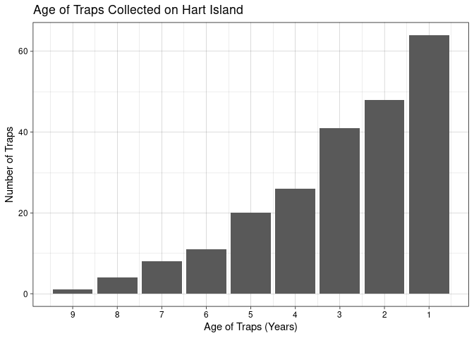
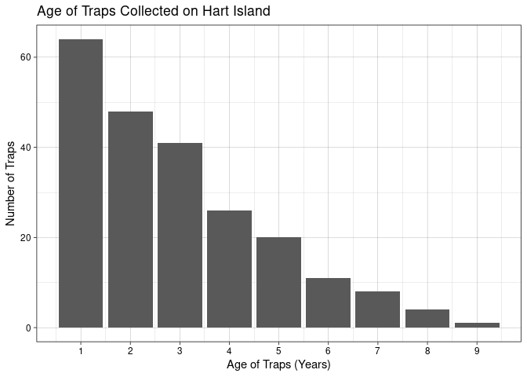

Hart Isalnd Trap memo
================
Big Harts

This document should contain a detailed account of the data clean up for
your data and the design choices you are making for your plots. For
instance you will want to document choices you’ve made that were
intentional for your graphic, e.g. color you’ve chosen for the plot.
Think of this document as a code script someone can follow to reproduce
the data cleaning steps and graphics in your handout.

``` r
library(tidyverse)
library(broom)
```

## Data Clean Up Steps for Overall Data

### Step 1: \_\_\_\_\_\_\_\_\_

``` r
lobsters <- read_csv(file = "../data/lobsters.csv")
```

    ## New names:
    ## Rows: 227 Columns: 28
    ## ── Column specification
    ## ──────────────────────────────────────────────────────── Delimiter: "," chr
    ## (12): DATE COLLECTED (m-d-y), STATE, Z: ZONE, AREA, TAG ID NUMBER, TRAP ... dbl
    ## (4): TAG COUNT, # TAGS IN BUNDLE, GPS COORDINATES-Lat, TAGYEAR lgl (12): ...17,
    ## ...18, ...19, ...20, ...21, ...22, ...23, ...24, ...25, ......
    ## ℹ Use `spec()` to retrieve the full column specification for this data. ℹ
    ## Specify the column types or set `show_col_types = FALSE` to quiet this message.
    ## • `` -> `...17`
    ## • `` -> `...18`
    ## • `` -> `...19`
    ## • `` -> `...20`
    ## • `` -> `...21`
    ## • `` -> `...22`
    ## • `` -> `...23`
    ## • `` -> `...24`
    ## • `` -> `...25`
    ## • `` -> `...26`
    ## • `` -> `...27`

``` r
glimpse(lobsters)
```

    ## Rows: 227
    ## Columns: 28
    ## $ `TAG COUNT`              <dbl> 90, 206, 31, 161, 183, 191, 43, 111, 201, 123…
    ## $ `DATE COLLECTED (m-d-y)` <chr> "8/24/2023", "8/24/2023", "8/24/2023", "8/24/…
    ## $ `# TAGS IN BUNDLE`       <dbl> 1, 1, 4, 1, 5, 2, 6, 5, 9, 1, 2, 2, 4, 3, 4, …
    ## $ STATE                    <chr> "ME", "ME", "ME", "ME", "ME", "ME", "ME", "ME…
    ## $ `Z: ZONE`                <chr> "D", "D", "D", "D", "D", "D", "D", "D", "D", …
    ## $ AREA                     <chr> "1", "1", "1", "1", "1", "1", "1", "1", "1", …
    ## $ `TAG ID NUMBER`          <chr> "435", "607", "754", "754", "1033", "1033", "…
    ## $ `TRAP BATCH NUMBER`      <chr> "72", "621", "94", "174", "499", "185", "142"…
    ## $ `TAG COLOUR`             <chr> "orange", "yellow", "light pink", "yellow", "…
    ## $ `SHORELINE WHERE FOUND`  <chr> "HART ISLAND", "HART ISLAND", "HART ISLAND", …
    ## $ `GPS COORDINATES-Lat`    <dbl> 43.90538, 43.90538, 43.90538, 43.90538, 43.90…
    ## $ `GPS COORD-Long`         <chr> "-69.266659", "-69.266659", "-69.266659", "-6…
    ## $ TAGYEAR                  <dbl> 2007, 2020, 2010, 2020, 2018, 2021, 2022, 202…
    ## $ `ADDITIONAL INFO ON TAG` <chr> NA, "also reads NON-CAT", NA, NA, NA, NA, "DM…
    ## $ `NAMED INDIVIDUAL`       <chr> "NOT IN 2021 DMR LICENSE LIST", "THOMAS YOUNG…
    ## $ `HOME PORT`              <chr> "N/A", "WINTER HBR", "PORT CLYDE", "PORT CLYD…
    ## $ ...17                    <lgl> NA, NA, NA, NA, NA, NA, NA, NA, NA, NA, NA, N…
    ## $ ...18                    <lgl> NA, NA, NA, NA, NA, NA, NA, NA, NA, NA, NA, N…
    ## $ ...19                    <lgl> NA, NA, NA, NA, NA, NA, NA, NA, NA, NA, NA, N…
    ## $ ...20                    <lgl> NA, NA, NA, NA, NA, NA, NA, NA, NA, NA, NA, N…
    ## $ ...21                    <lgl> NA, NA, NA, NA, NA, NA, NA, NA, NA, NA, NA, N…
    ## $ ...22                    <lgl> NA, NA, NA, NA, NA, NA, NA, NA, NA, NA, NA, N…
    ## $ ...23                    <lgl> NA, NA, NA, NA, NA, NA, NA, NA, NA, NA, NA, N…
    ## $ ...24                    <lgl> NA, NA, NA, NA, NA, NA, NA, NA, NA, NA, NA, N…
    ## $ ...25                    <lgl> NA, NA, NA, NA, NA, NA, NA, NA, NA, NA, NA, N…
    ## $ ...26                    <lgl> NA, NA, NA, NA, NA, NA, NA, NA, NA, NA, NA, N…
    ## $ ...27                    <lgl> NA, NA, NA, NA, NA, NA, NA, NA, NA, NA, NA, N…
    ## $ MISCELLANEOUS            <lgl> NA, NA, NA, NA, NA, NA, NA, NA, NA, NA, NA, N…

Remove unnecessary text rows at bottom of dataset:

``` r
true_lobsters <- head(lobsters, -4)
glimpse(true_lobsters)
```

    ## Rows: 223
    ## Columns: 28
    ## $ `TAG COUNT`              <dbl> 90, 206, 31, 161, 183, 191, 43, 111, 201, 123…
    ## $ `DATE COLLECTED (m-d-y)` <chr> "8/24/2023", "8/24/2023", "8/24/2023", "8/24/…
    ## $ `# TAGS IN BUNDLE`       <dbl> 1, 1, 4, 1, 5, 2, 6, 5, 9, 1, 2, 2, 4, 3, 4, …
    ## $ STATE                    <chr> "ME", "ME", "ME", "ME", "ME", "ME", "ME", "ME…
    ## $ `Z: ZONE`                <chr> "D", "D", "D", "D", "D", "D", "D", "D", "D", …
    ## $ AREA                     <chr> "1", "1", "1", "1", "1", "1", "1", "1", "1", …
    ## $ `TAG ID NUMBER`          <chr> "435", "607", "754", "754", "1033", "1033", "…
    ## $ `TRAP BATCH NUMBER`      <chr> "72", "621", "94", "174", "499", "185", "142"…
    ## $ `TAG COLOUR`             <chr> "orange", "yellow", "light pink", "yellow", "…
    ## $ `SHORELINE WHERE FOUND`  <chr> "HART ISLAND", "HART ISLAND", "HART ISLAND", …
    ## $ `GPS COORDINATES-Lat`    <dbl> 43.90538, 43.90538, 43.90538, 43.90538, 43.90…
    ## $ `GPS COORD-Long`         <chr> "-69.266659", "-69.266659", "-69.266659", "-6…
    ## $ TAGYEAR                  <dbl> 2007, 2020, 2010, 2020, 2018, 2021, 2022, 202…
    ## $ `ADDITIONAL INFO ON TAG` <chr> NA, "also reads NON-CAT", NA, NA, NA, NA, "DM…
    ## $ `NAMED INDIVIDUAL`       <chr> "NOT IN 2021 DMR LICENSE LIST", "THOMAS YOUNG…
    ## $ `HOME PORT`              <chr> "N/A", "WINTER HBR", "PORT CLYDE", "PORT CLYD…
    ## $ ...17                    <lgl> NA, NA, NA, NA, NA, NA, NA, NA, NA, NA, NA, N…
    ## $ ...18                    <lgl> NA, NA, NA, NA, NA, NA, NA, NA, NA, NA, NA, N…
    ## $ ...19                    <lgl> NA, NA, NA, NA, NA, NA, NA, NA, NA, NA, NA, N…
    ## $ ...20                    <lgl> NA, NA, NA, NA, NA, NA, NA, NA, NA, NA, NA, N…
    ## $ ...21                    <lgl> NA, NA, NA, NA, NA, NA, NA, NA, NA, NA, NA, N…
    ## $ ...22                    <lgl> NA, NA, NA, NA, NA, NA, NA, NA, NA, NA, NA, N…
    ## $ ...23                    <lgl> NA, NA, NA, NA, NA, NA, NA, NA, NA, NA, NA, N…
    ## $ ...24                    <lgl> NA, NA, NA, NA, NA, NA, NA, NA, NA, NA, NA, N…
    ## $ ...25                    <lgl> NA, NA, NA, NA, NA, NA, NA, NA, NA, NA, NA, N…
    ## $ ...26                    <lgl> NA, NA, NA, NA, NA, NA, NA, NA, NA, NA, NA, N…
    ## $ ...27                    <lgl> NA, NA, NA, NA, NA, NA, NA, NA, NA, NA, NA, N…
    ## $ MISCELLANEOUS            <lgl> NA, NA, NA, NA, NA, NA, NA, NA, NA, NA, NA, N…


    ### Step 2: ________

    ## Plots

    ### ggsave example for saving plots


    ``` r
    p1 <- starwars |>
      filter(mass < 1000, 
             species %in% c("Human", "Cerean", "Pau'an", "Droid", "Gungan")) |>
      ggplot() +
      geom_point(aes(x = mass, 
                     y = height, 
                     color = species)) +
      labs(x = "Weight (kg)", 
           y = "Height (m)",
           color = "Species",
           title = "Weight and Height of Select Starwars Species",
           caption = paste("This data comes from the starwars api: https://swapi.py43.com"))


    ggsave("example-starwars.png", width = 4, height = 4)

    ggsave("example-starwars-wide.png", width = 6, height = 4)

### Plot 1: \_\_\_\_\_\_\_\_\_

``` r
ggplot(data = true_lobsters, mapping = aes(x = `# TAGS IN BUNDLE`)) +
  geom_bar() +
  labs(x = "Age of Traps (Years)", y = "Number of Traps",
  title = "Age of Traps Collected on Hart Island") +
  theme_linedraw() +
  scale_x_reverse(breaks = seq(10, 0, by = -1))
```

<!-- -->

``` r
ggsave("hart-traps-ages.png", width = 4, height = 4)
```

``` r
ggplot(data = true_lobsters, mapping = aes(x = `# TAGS IN BUNDLE`)) +
  geom_bar() +
  labs(x = "Age of Traps (Years)", y = "Number of Traps",
  title = "Age of Traps Collected on Hart Island") +
  theme_linedraw() +
  scale_x_continuous(breaks = seq(0, 10, by = 1))
```

<!-- -->

``` r
ggsave("hart-traps-ages-2.png", width = 4, height = 4)
```

#### Data cleanup steps specific to plot 1

These data cleaning sections are optional and depend on if you have some
data cleaning steps specific to a particular plot

#### Final Plot 1

### Plot 2: \_\_\_\_\_\_\_\_\_

### Plot 3: \_\_\_\_\_\_\_\_\_\_\_

Add more plot sections as needed. Each project should have at least 3
plots, but talk to me if you have fewer than 3.

### Plot 4: \_\_\_\_\_\_\_\_\_\_\_
