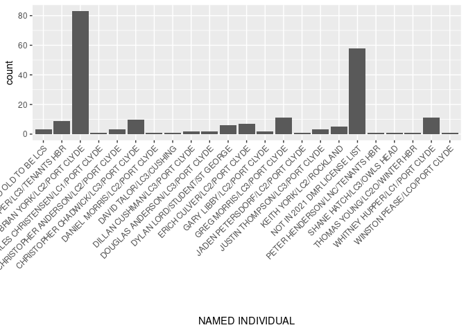
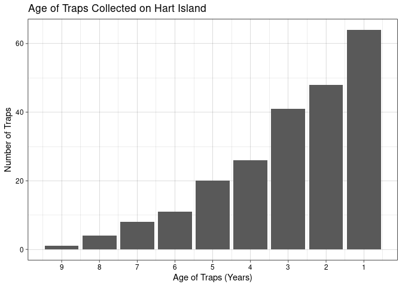

Hart Island Lobster Traps
================
Big Harts!

``` r
library(tidyverse)
library(broom)
```

## 1. Introduction

This data set was provided from the Rozalia Project, a non-profit that
works on collection, research, and education of marine debis around the
Gulf of Maine. Most of what debris is collected and cataloged can be
tied to the fishing industries in the region. Collecting lobster trap
data through these methods has the potential to to help this industry
understand trap losses in this region in order to minimize/prevent
future loss of these mataerials.

This data was collected on August 24th, 2023 on Hart Island, a small
island just Southwest of Port Clyde, ME. Volunteers worked to remove
lost, abandoned and derelict fishing gear and other coastal debris. For
each lobster trap found, the trap tags were pulled and recorded
including: tag count, data collected (MDY), number of tags in bundle,
state, zone, area, tag ID, trap batch number, tag color, shoreline where
found, GPS (lat/long), tag year, additional info on tag, named
individual, and home port.

With this data we aim to explore the relationship between abandoned
lobster traps and the individuals who deployed them and the lifespan of
traps. We hope that this data can be added to a more substantial dataset
including more islands across the Gulf of Maine as more are surveyed.

## 2. Data

``` r
lobsters <- read_csv(file = "../data/lobsters.csv")
```

    ## New names:
    ## Rows: 227 Columns: 28
    ## ── Column specification
    ## ──────────────────────────────────────────────────────── Delimiter: "," chr
    ## (12): DATE COLLECTED (m-d-y), STATE, Z: ZONE, AREA, TAG ID NUMBER, TRAP ... dbl
    ## (4): TAG COUNT, # TAGS IN BUNDLE, GPS COORDINATES-Lat, TAGYEAR lgl (12): ...17,
    ## ...18, ...19, ...20, ...21, ...22, ...23, ...24, ...25, ......
    ## ℹ Use `spec()` to retrieve the full column specification for this data. ℹ
    ## Specify the column types or set `show_col_types = FALSE` to quiet this message.
    ## • `` -> `...17`
    ## • `` -> `...18`
    ## • `` -> `...19`
    ## • `` -> `...20`
    ## • `` -> `...21`
    ## • `` -> `...22`
    ## • `` -> `...23`
    ## • `` -> `...24`
    ## • `` -> `...25`
    ## • `` -> `...26`
    ## • `` -> `...27`

``` r
glimpse(lobsters)
```

    ## Rows: 227
    ## Columns: 28
    ## $ `TAG COUNT`              <dbl> 90, 206, 31, 161, 183, 191, 43, 111, 201, 123…
    ## $ `DATE COLLECTED (m-d-y)` <chr> "8/24/2023", "8/24/2023", "8/24/2023", "8/24/…
    ## $ `# TAGS IN BUNDLE`       <dbl> 1, 1, 4, 1, 5, 2, 6, 5, 9, 1, 2, 2, 4, 3, 4, …
    ## $ STATE                    <chr> "ME", "ME", "ME", "ME", "ME", "ME", "ME", "ME…
    ## $ `Z: ZONE`                <chr> "D", "D", "D", "D", "D", "D", "D", "D", "D", …
    ## $ AREA                     <chr> "1", "1", "1", "1", "1", "1", "1", "1", "1", …
    ## $ `TAG ID NUMBER`          <chr> "435", "607", "754", "754", "1033", "1033", "…
    ## $ `TRAP BATCH NUMBER`      <chr> "72", "621", "94", "174", "499", "185", "142"…
    ## $ `TAG COLOUR`             <chr> "orange", "yellow", "light pink", "yellow", "…
    ## $ `SHORELINE WHERE FOUND`  <chr> "HART ISLAND", "HART ISLAND", "HART ISLAND", …
    ## $ `GPS COORDINATES-Lat`    <dbl> 43.90538, 43.90538, 43.90538, 43.90538, 43.90…
    ## $ `GPS COORD-Long`         <chr> "-69.266659", "-69.266659", "-69.266659", "-6…
    ## $ TAGYEAR                  <dbl> 2007, 2020, 2010, 2020, 2018, 2021, 2022, 202…
    ## $ `ADDITIONAL INFO ON TAG` <chr> NA, "also reads NON-CAT", NA, NA, NA, NA, "DM…
    ## $ `NAMED INDIVIDUAL`       <chr> "NOT IN 2021 DMR LICENSE LIST", "THOMAS YOUNG…
    ## $ `HOME PORT`              <chr> "N/A", "WINTER HBR", "PORT CLYDE", "PORT CLYD…
    ## $ ...17                    <lgl> NA, NA, NA, NA, NA, NA, NA, NA, NA, NA, NA, N…
    ## $ ...18                    <lgl> NA, NA, NA, NA, NA, NA, NA, NA, NA, NA, NA, N…
    ## $ ...19                    <lgl> NA, NA, NA, NA, NA, NA, NA, NA, NA, NA, NA, N…
    ## $ ...20                    <lgl> NA, NA, NA, NA, NA, NA, NA, NA, NA, NA, NA, N…
    ## $ ...21                    <lgl> NA, NA, NA, NA, NA, NA, NA, NA, NA, NA, NA, N…
    ## $ ...22                    <lgl> NA, NA, NA, NA, NA, NA, NA, NA, NA, NA, NA, N…
    ## $ ...23                    <lgl> NA, NA, NA, NA, NA, NA, NA, NA, NA, NA, NA, N…
    ## $ ...24                    <lgl> NA, NA, NA, NA, NA, NA, NA, NA, NA, NA, NA, N…
    ## $ ...25                    <lgl> NA, NA, NA, NA, NA, NA, NA, NA, NA, NA, NA, N…
    ## $ ...26                    <lgl> NA, NA, NA, NA, NA, NA, NA, NA, NA, NA, NA, N…
    ## $ ...27                    <lgl> NA, NA, NA, NA, NA, NA, NA, NA, NA, NA, NA, N…
    ## $ MISCELLANEOUS            <lgl> NA, NA, NA, NA, NA, NA, NA, NA, NA, NA, NA, N…

Remove unnecessary text rows at bottom of dataset:

``` r
true_lobsters <- head(lobsters, -4)
glimpse(true_lobsters)
```

    ## Rows: 223
    ## Columns: 28
    ## $ `TAG COUNT`              <dbl> 90, 206, 31, 161, 183, 191, 43, 111, 201, 123…
    ## $ `DATE COLLECTED (m-d-y)` <chr> "8/24/2023", "8/24/2023", "8/24/2023", "8/24/…
    ## $ `# TAGS IN BUNDLE`       <dbl> 1, 1, 4, 1, 5, 2, 6, 5, 9, 1, 2, 2, 4, 3, 4, …
    ## $ STATE                    <chr> "ME", "ME", "ME", "ME", "ME", "ME", "ME", "ME…
    ## $ `Z: ZONE`                <chr> "D", "D", "D", "D", "D", "D", "D", "D", "D", …
    ## $ AREA                     <chr> "1", "1", "1", "1", "1", "1", "1", "1", "1", …
    ## $ `TAG ID NUMBER`          <chr> "435", "607", "754", "754", "1033", "1033", "…
    ## $ `TRAP BATCH NUMBER`      <chr> "72", "621", "94", "174", "499", "185", "142"…
    ## $ `TAG COLOUR`             <chr> "orange", "yellow", "light pink", "yellow", "…
    ## $ `SHORELINE WHERE FOUND`  <chr> "HART ISLAND", "HART ISLAND", "HART ISLAND", …
    ## $ `GPS COORDINATES-Lat`    <dbl> 43.90538, 43.90538, 43.90538, 43.90538, 43.90…
    ## $ `GPS COORD-Long`         <chr> "-69.266659", "-69.266659", "-69.266659", "-6…
    ## $ TAGYEAR                  <dbl> 2007, 2020, 2010, 2020, 2018, 2021, 2022, 202…
    ## $ `ADDITIONAL INFO ON TAG` <chr> NA, "also reads NON-CAT", NA, NA, NA, NA, "DM…
    ## $ `NAMED INDIVIDUAL`       <chr> "NOT IN 2021 DMR LICENSE LIST", "THOMAS YOUNG…
    ## $ `HOME PORT`              <chr> "N/A", "WINTER HBR", "PORT CLYDE", "PORT CLYD…
    ## $ ...17                    <lgl> NA, NA, NA, NA, NA, NA, NA, NA, NA, NA, NA, N…
    ## $ ...18                    <lgl> NA, NA, NA, NA, NA, NA, NA, NA, NA, NA, NA, N…
    ## $ ...19                    <lgl> NA, NA, NA, NA, NA, NA, NA, NA, NA, NA, NA, N…
    ## $ ...20                    <lgl> NA, NA, NA, NA, NA, NA, NA, NA, NA, NA, NA, N…
    ## $ ...21                    <lgl> NA, NA, NA, NA, NA, NA, NA, NA, NA, NA, NA, N…
    ## $ ...22                    <lgl> NA, NA, NA, NA, NA, NA, NA, NA, NA, NA, NA, N…
    ## $ ...23                    <lgl> NA, NA, NA, NA, NA, NA, NA, NA, NA, NA, NA, N…
    ## $ ...24                    <lgl> NA, NA, NA, NA, NA, NA, NA, NA, NA, NA, NA, N…
    ## $ ...25                    <lgl> NA, NA, NA, NA, NA, NA, NA, NA, NA, NA, NA, N…
    ## $ ...26                    <lgl> NA, NA, NA, NA, NA, NA, NA, NA, NA, NA, NA, N…
    ## $ ...27                    <lgl> NA, NA, NA, NA, NA, NA, NA, NA, NA, NA, NA, N…
    ## $ MISCELLANEOUS            <lgl> NA, NA, NA, NA, NA, NA, NA, NA, NA, NA, NA, N…

## 3. Data analysis plan

1)  We hope to use tag year and color, \# of tags in bundle, named
    individual, tag ID number, and homeport.

2)  We will try to find data showing the \# of traps per individual so
    as to better understand the ratio of lost traps on Hart island to
    total \# of traps. In addition, we hope to compare the home port of
    the traps to the number of tags in each bundle to see if there’s a
    link between the longevity of a trap and the port it came from.

3)  The prelim_vis_testing graph below helps show the number of lost
    traps per individual, and the age_traps graph shows the correlation
    between age of traps and number of traps.

4)  We hope to build on the graphs below to better show relationships
    between traps and individuals and show the range of trap age.

5)  We are also considering looking to see if there is a correlation
    between a trap’s homeport and the number of tags in the bundle
    (which represents how many )

``` r
ggplot(data = true_lobsters, mapping = aes(x = `NAMED INDIVIDUAL`)) +
  geom_bar() +
theme(axis.text.x = element_text(angle = 45, hjust = 1))
```

<!-- -->

``` r
ggplot(data = true_lobsters, mapping = aes(x = `# TAGS IN BUNDLE`)) +
  geom_bar() +
  labs(x = "Age of Traps (Years)", y = "Number of Traps",
  title = "Age of Traps Collected on Hart Island") +
  theme_linedraw() +
  scale_x_reverse(breaks = seq(10, 0, by = -1))
```

<!-- -->

``` r
ggplot(data = true_lobsters, mapping = aes(x = `# TAGS IN BUNDLE`)) +
  geom_bar() +
  labs(x = "Age of Traps (Years)", y = "Number of Traps",
  title = "Age of Traps Collected on Hart Island") +
  theme_linedraw() +
  scale_x_continuous(breaks = seq(0, 10, by = 1))
```

<!-- -->

## 4. Data Ethics Review

The data ethics review section will be introduced in a separate class
and is not part of the original proposal deadline.
